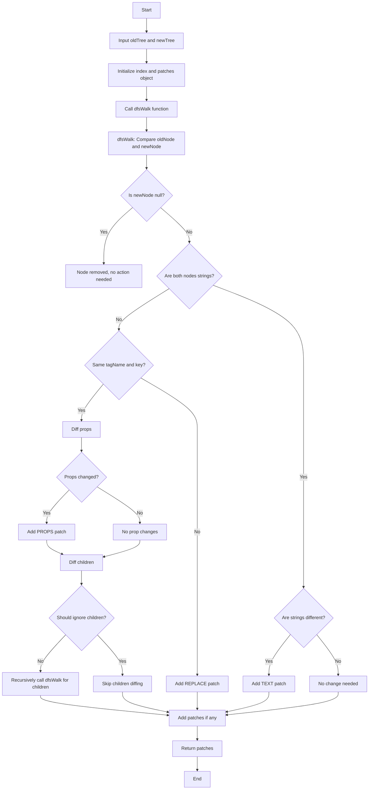

```mermaid
graph TD
    A[Start] --> B[Input oldTree and newTree]
    B --> C[Initialize index and patches object]
    C --> D[Call dfsWalk function]
    D --> E[dfsWalk: Compare oldNode and newNode]
    E --> F{Is newNode null?}
    F -->|Yes| G[Node removed, no action needed]
    F -->|No| H{Are both nodes strings?}
    H -->|Yes| I{Are strings different?}
    I -->|Yes| J[Add TEXT patch]
    I -->|No| K[No change needed]
    H -->|No| L{Same tagName and key?}
    L -->|Yes| M[Diff props]
    M --> N{Props changed?}
    N -->|Yes| O[Add PROPS patch]
    N -->|No| P[No prop changes]
    O --> Q[Diff children]
    P --> Q
    Q --> R{Should ignore children?}
    R -->|No| S[Recursively call dfsWalk for children]
    R -->|Yes| T[Skip children diffing]
    L -->|No| U[Add REPLACE patch]
    S --> V[Add patches if any]
    T --> V
    U --> V
    J --> V
    K --> V
    V --> W[Return patches]
    W --> X[End]
```