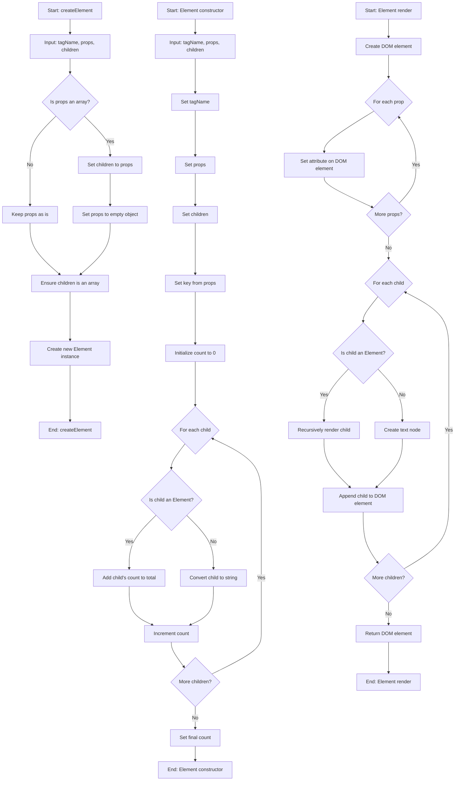

```mermaid
graph TD
    A[Start: createElement] --> B[Input: tagName, props, children]
    B --> C{Is props an array?}
    C -->|Yes| D[Set children to props]
    C -->|No| E[Keep props as is]
    D --> F[Set props to empty object]
    E --> G[Ensure children is an array]
    F --> G
    G --> H[Create new Element instance]
    H --> I[End: createElement]

    J[Start: Element constructor] --> K[Input: tagName, props, children]
    K --> L[Set tagName]
    L --> M[Set props]
    M --> N[Set children]
    N --> O[Set key from props]
    O --> P[Initialize count to 0]
    P --> Q{For each child}
    Q --> R{Is child an Element?}
    R -->|Yes| S[Add child's count to total]
    R -->|No| T[Convert child to string]
    S --> U[Increment count]
    T --> U
    U --> V{More children?}
    V -->|Yes| Q
    V -->|No| W[Set final count]
    W --> X[End: Element constructor]

    Y[Start: Element render] --> Z[Create DOM element]
    Z --> AA{For each prop}
    AA --> AB[Set attribute on DOM element]
    AB --> AC{More props?}
    AC -->|Yes| AA
    AC -->|No| AD{For each child}
    AD --> AE{Is child an Element?}
    AE -->|Yes| AF[Recursively render child]
    AE -->|No| AG[Create text node]
    AF --> AH[Append child to DOM element]
    AG --> AH
    AH --> AI{More children?}
    AI -->|Yes| AD
    AI -->|No| AJ[Return DOM element]
    AJ --> AK[End: Element render]
```