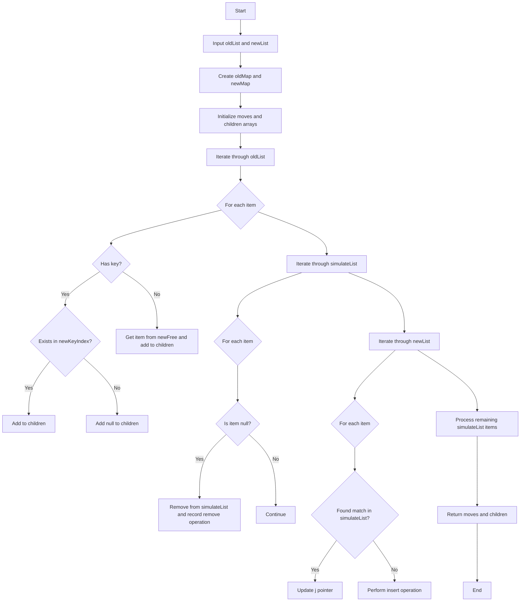

```mermaid
graph TD
    A[Start] --> B[Input oldList and newList]
    B --> C[Create oldMap and newMap]
    C --> D[Initialize moves and children arrays]
    D --> E[Iterate through oldList]
    E --> F{For each item}
    F --> G{Has key?}
    G -->|Yes| H{Exists in newKeyIndex?}
    H -->|Yes| I[Add to children]
    H -->|No| J[Add null to children]
    G -->|No| K[Get item from newFree and add to children]
    F --> L[Iterate through simulateList]
    L --> M{For each item}
    M --> N{Is item null?}
    N -->|Yes| O[Remove from simulateList and record remove operation]
    N -->|No| P[Continue]
    L --> Q[Iterate through newList]
    Q --> R{For each item}
    R --> S{Found match in simulateList?}
    S -->|Yes| T[Update j pointer]
    S -->|No| U[Perform insert operation]
    Q --> V[Process remaining simulateList items]
    V --> W[Return moves and children]
    W --> X[End]
```