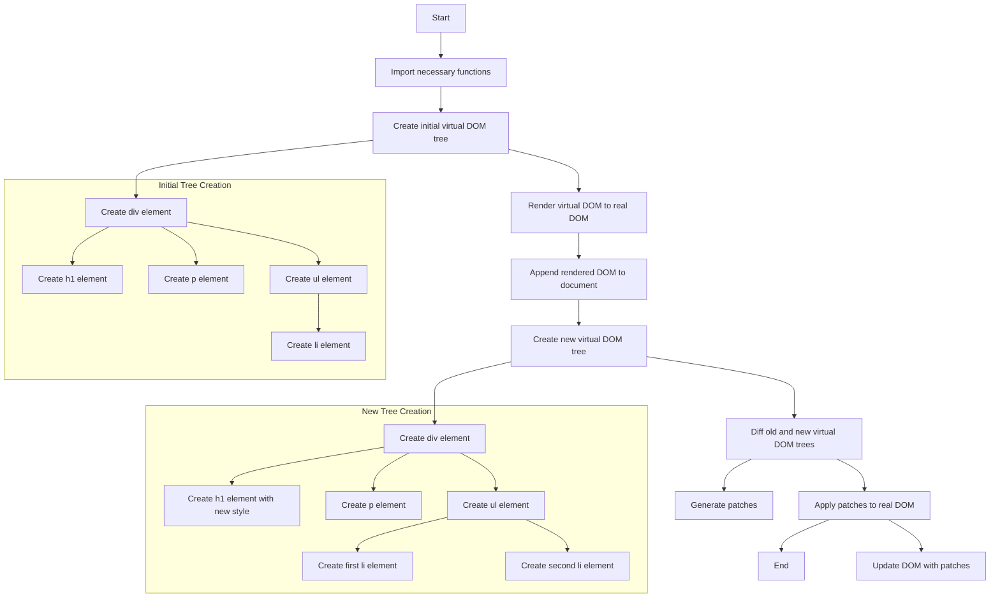

```mermaid
graph TD
    A[Start] --> B[Import necessary functions]
    B --> C[Create initial virtual DOM tree]
    C --> D[Render virtual DOM to real DOM]
    D --> E[Append rendered DOM to document]
    E --> F[Create new virtual DOM tree]
    F --> G[Diff old and new virtual DOM trees]
    G --> H[Apply patches to real DOM]
    H --> I[End]

    subgraph "Initial Tree Creation"
    C1[Create div element]
    C2[Create h1 element]
    C3[Create p element]
    C4[Create ul element]
    C5[Create li element]
    C1 --> C2
    C1 --> C3
    C1 --> C4
    C4 --> C5
    end

    subgraph "New Tree Creation"
    F1[Create div element]
    F2[Create h1 element with new style]
    F3[Create p element]
    F4[Create ul element]
    F5[Create first li element]
    F6[Create second li element]
    F1 --> F2
    F1 --> F3
    F1 --> F4
    F4 --> F5
    F4 --> F6
    end

    C --> C1
    F --> F1
    G --> G1[Generate patches]
    H --> H1[Update DOM with patches]
```