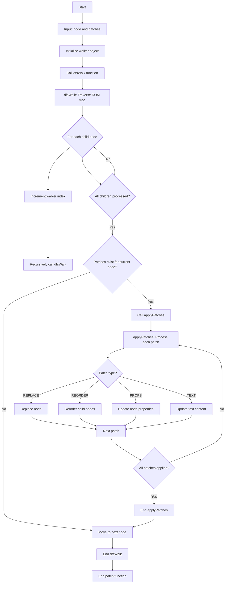

```mermaid
graph TD
    A[Start] --> B[Input: node and patches]
    B --> C[Initialize walker object]
    C --> D[Call dfsWalk function]
    D --> E[dfsWalk: Traverse DOM tree]
    E --> F{For each child node}
    F --> G[Increment walker index]
    G --> H[Recursively call dfsWalk]
    F --> I{All children processed?}
    I -->|No| F
    I -->|Yes| J{Patches exist for current node?}
    J -->|Yes| K[Call applyPatches]
    J -->|No| L[Move to next node]
    K --> M[applyPatches: Process each patch]
    M --> N{Patch type?}
    N -->|REPLACE| O[Replace node]
    N -->|REORDER| P[Reorder child nodes]
    N -->|PROPS| Q[Update node properties]
    N -->|TEXT| R[Update text content]
    O --> S[Next patch]
    P --> S
    Q --> S
    R --> S
    S --> T{All patches applied?}
    T -->|No| M
    T -->|Yes| U[End applyPatches]
    U --> L
    L --> V[End dfsWalk]
    V --> W[End patch function]
```